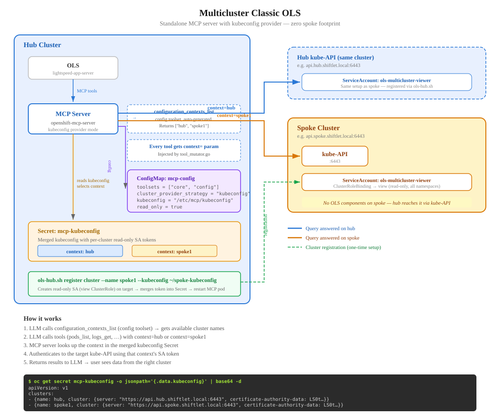

# Multicluster Classic OLS Demo

Multicluster troubleshooting with OpenShift Lightspeed (classic, user-initiated chat). One hub cluster queries multiple spoke clusters via a standalone MCP server with the kubeconfig provider strategy.

**Status**: all setup steps working end-to-end. Demo recording pending.

## Prerequisites

- Two OpenShift 4.22+ clusters (tested with [shiftlet](https://github.com/kgordeev/shiftlet)-provisioned SNO clusters)
- `oc` CLI logged into the hub cluster
- `ONLY_OLS_OPENAI_API_KEY` set in your shell environment
- Spoke cluster's kubeconfig copied to the hub host
- A default StorageClass on both clusters (the payments scenario uses a PVC). For shiftlet SNOs:
  ```bash
  oc apply -f https://raw.githubusercontent.com/rancher/local-path-provisioner/master/deploy/local-path-storage.yaml
  oc annotate storageclass local-path storageclass.kubernetes.io/is-default-class=true
  ```

## Quick start

Copy `.env.example` to `.env` and edit for your cluster hostnames, IPs, and kubeconfig paths (defaults work for shiftlet), then:

```bash
cp .env.example .env   # edit if not using shiftlet defaults
export ONLY_OLS_OPENAI_API_KEY=sk-...
./setup.sh
```

The script is idempotent — it detects already-completed steps and skips them.

## Check available models

With `ONLY_OLS_OPENAI_API_KEY` exported, list model IDs available to the API key or check a specific model:

```bash
python3 manifests/ols/check-models.py
python3 manifests/ols/check-models.py gpt-5.6-luna
```

This calls `GET /v1/models` and does not make an inference request

## What `setup.sh` does

| Step | What | Status |
|------|------|--------|
| 1 | Install OLS operator + configure OLSConfig | Done |
| 2 | Deploy standalone MCP server (kubeconfig provider) | Done |
| 3 | Register hub as "production" cluster (`ols-hub.sh register cluster`) | Done |
| 4 | Register spoke as "staging" cluster (`ols-hub.sh register cluster`) | Done |
| 5 | Deploy payments-api-failure scenario on both clusters | Done |
| 6 | Break staging (roll reporting-service to buggy v1.0.2) | Done |

## Repo structure

```
├── .env.example                  # Environment config template (cp to .env)
├── setup.sh                      # End-to-end setup (reads .env)
├── teardown.sh                   # Reverse of setup (keeps OLS installed)
├── ols-hub.sh                    # Register/deregister clusters
├── manifests/
│   ├── ols/                      # OLS operator install (or install from UI)
│   │   ├── 00-namespace.yaml
│   │   ├── 01-operatorgroup.yaml
│   │   ├── 02-subscription.yaml
│   │   ├── 03-credentials-secret.yaml.template  # LLM API key (ONLY_OLS_OPENAI_API_KEY substituted)
│   │   ├── 04-olsconfig.yaml    # Includes mcpServers + introspectionEnabled: false
│   │   ├── check-models.py      # Lists or checks models available to the API key
│   │   └── install.sh
│   ├── mcp-server/               # Standalone openshift-mcp-server
│   │   ├── 00-config.yaml        # ConfigMap: kubeconfig provider, core+config toolsets
│   │   ├── 01-deployment.yaml    # Deployment + Service (hostAliases for non-DNS clusters)
│   │   ├── 02-empty-kubeconfig-secret.yaml  # Placeholder Secret (populated by ols-hub.sh)
│   │   └── install.sh
│   └── cluster-registration/     # Cluster registration manifests + script
│       ├── 00-sa.yaml.template               # ServiceAccount + ClusterRoleBinding
│       ├── 01-kubeconfig-token.yaml.template # Kubeconfig with token auth
│       ├── 01-kubeconfig-cert.yaml.template  # Kubeconfig with cert auth (--no-sa)
│       ├── register.sh
│       └── deregister.sh
├── scenarios/                    # Copied from rhobs/troubleshooting-scenarios (PVC → emptyDir)
│   ├── 01-payments-api-failure/  # Connection leak scenario (used in this demo)
│   ├── 02-alert-storm/
│   ├── 03-image-pull-failure/
│   └── 04-control-plane-alerts/
└── README.md
```

## Cluster registration

```bash
# Register (creates read-only SA with view ClusterRole by default)
./ols-hub.sh register cluster --name production --kubeconfig /var/lib/shiftlet/hub/kubeconfig
./ols-hub.sh register cluster --name staging --kubeconfig ~/spoke-kubeconfig

# Skip SA creation, use kubeconfig credentials directly (kubeadmin-level)
./ols-hub.sh register cluster --name staging --kubeconfig ~/spoke-kubeconfig --no-sa

# Deregister (removes SA from target cluster + context from Secret)
./ols-hub.sh deregister cluster --name staging --kubeconfig ~/spoke-kubeconfig

# Restart MCP server to pick up changes (required — fsnotify does not detect Secret volume updates)
oc rollout restart deployment/openshift-mcp-server -n openshift-lightspeed
```

## Architecture



## Limitations

- **Auth is cluster-level, not per-user**: all OLS users share a read-only ServiceAccount per cluster. Per-user RBAC requires MCE + Keycloak.
- **Metrics toolset is not multicluster-aware**: Prometheus queries always hit the hub's Thanos. Spoke troubleshooting uses core tools (pods, logs, events).
- **DNS**: cluster API hostnames must be resolvable from the MCP server pod. For non-DNS environments (e.g. libvirt), the Deployment uses `hostAliases`.
- **Kubeadmin required**: registering clusters requires kubeadmin-level access to create ServiceAccounts and ClusterRoleBindings.
- **MCP server restart required after registration**: the kubeconfig file watcher uses fsnotify which does not detect Kubernetes Secret volume updates (symlink swaps). A pod restart is needed after registering or deregistering clusters.

## Next demo (separate repo)

- Test with MCE/Keycloak for more granular RBAC
- Use MCE as a source for importing spoke credentials via ManagedCluster CR
- Cluster-proxy for spokes whose kube-API is not accessible from outside the cluster (common enterprise scenario)
